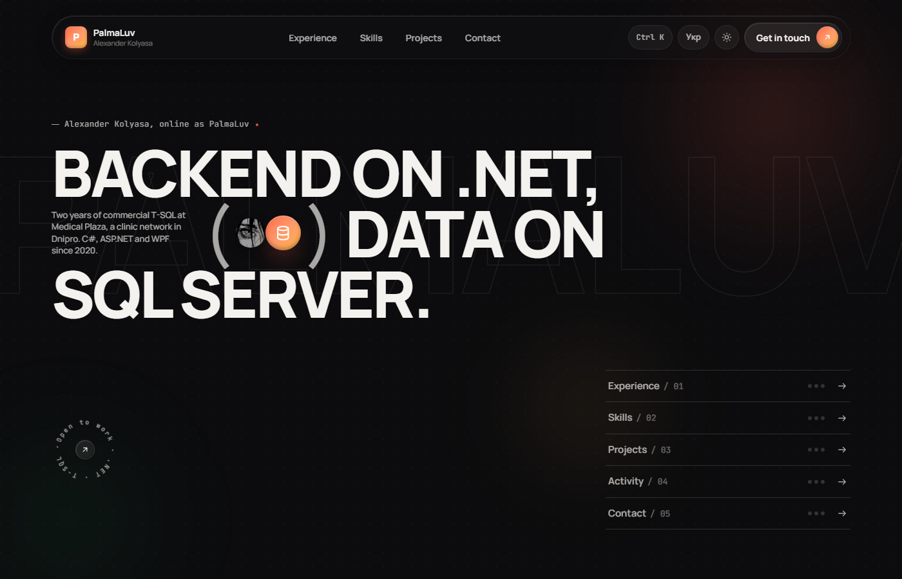

## Олександр Коляса — портфоліо

[](README.md)

**Сайт:** [palmaluv.github.io/palma.github.io](https://palmaluv.github.io/palma.github.io/) · українською: [/uk/](https://palmaluv.github.io/palma.github.io/uk/)

Портфоліо розробника .NET і T-SQL. Один JSON-файл описує людину; невеликий Python-скрипт перетворює його на сайт двома мовами та резюме у HTML і PDF. На сторінці — чистий HTML, CSS і JavaScript; без фреймворків і npm.



### Що є на сторінці

- **Палітра команд.** `Ctrl K` — перейти до розділу, відкрити посилання, змінити тему чи мову, завантажити CV.
- **Календарі активності.** Сабміти на LeetCode і контрибуції на GitHub по днях, у стилі GitHub, оновлюються щоночі.
- **CV.** Генерується з тих самих даних, англійською й українською, у HTML і PDF.
- **Англійська та українська.** Дві статичні сторінки з `hreflang`, а не перемикач на клієнті.
- **404.** Змійка на JavaScript, за мотивами репозиторію на C++.

### Структура

```
content/
  profile.json         людина: ім'я, ролі, досвід, навички, проєкти, en і uk
  strings.json         усі рядки інтерфейсу, en і uk
templates/             index.html, cv.html
scripts/
  build.py             content + templates + data -> src/ (лише стандартна бібліотека)
  fetch-leetcode.py    GraphQL LeetCode -> src/data/leetcode.json
  fetch-github.py      GraphQL GitHub (або публічна сторінка контрибуцій) -> src/data/github.json
src/                   зібраний сайт, публікується як є на GitHub Pages
drafts/                попередні варіанти дизайну, не публікуються
.github/workflows/refresh-and-deploy.yml
```

### Редагування

Змінити `content/*.json`, потім зібрати:

```
python scripts/build.py
```

Крок з PDF шукає Chrome або Edge і пропускає себе, якщо їх немає; воркфлоу завжди його робить. Переглянути локально — вбудованим сервером, який віддає `404.html` на неіснуючі адреси так само, як GitHub Pages:

```
python scripts/serve.py
```

### Як сайт оновлює себе сам

Воркфлоу запускається щоночі, на кожен пуш у `main` і вручну: тягне обидва календарі, збирає сайт, комітить `src/`, якщо цифри змінилися, і публікує `src/` у гілку `gh-pages`, яку роздає GitHub Pages.
